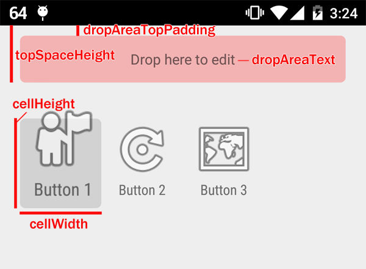

Grid-based reorderable view like Android home screen

## Download

If you are using Android Studio, add the following line to the `dependencies` section in your module-level build.gradle.

    implementation 'net.kyu_mu:pigeonholeview:1.0.4'

## Usage

An example app is available at [app](app) directory. To run the example app, open this top-level directory in Android Studio and press the "Run" button.

The instructions below are a complete guide to integrate PigeonholeView in your app.

First, define a class that holds the data for a single cell. Include an `int` instance variable which stores a view position in PigeonholeView.

MyData.java:

    /**
     * Data for a single cell.
     */
    public class MyData {
        private String name;
        private int imageResourceId;
        private int viewPosition; // view position in PigeonholeView

        public MyData(String name, int imageResourceId, int viewPosition) {
            this.name = name;
            this.imageResourceId = imageResourceId;
            this.viewPosition = viewPosition;
        }

        public String getName() {
            return name;
        }

        public void setName(String name) {
            this.name = name;
        }

        public int getImageResourceId() {
            return imageResourceId;
        }

        public void setImageResourceId(int imageResourceId) {
            this.imageResourceId = imageResourceId;
        }

        public int getViewPosition() {
            return viewPosition;
        }

        public void setViewPosition(int viewPosition) {
            this.viewPosition = viewPosition;
        }
    }

Then, create an Activity that contains PigeonholeView. In the example below, all parameters prefixed with `custom:` are optional. In order to use `custom:` attributes, you have to add `xmlns:custom="http://schemas.android.com/apk/res-auto"` to the root element. For details of the attributes, see [XML Attributes](#xml-attributes).

activity_main.xml:

    <RelativeLayout xmlns:android="http://schemas.android.com/apk/res/android"
        xmlns:custom="http://schemas.android.com/apk/res-auto"
        xmlns:tools="http://schemas.android.com/tools"
        android:layout_width="match_parent"
        android:layout_height="match_parent"
        tools:context=".MainActivity">

        <net.kyu_mu.pigeonholeview.PigeonholeView
            android:id="@+id/my_pigeonhole_view"
            android:layout_width="match_parent"
            android:layout_height="match_parent"
            custom:cellHeight="88dp"
            custom:cellWidth="80dp"
            custom:dragStartAnimationDuration="100"
            custom:dropAreaText="Drop here to edit"
            custom:dropAreaTopPadding="10dp"
            custom:editable="true"
            custom:topSpaceHeight="?attr/actionBarSize" />

    </RelativeLayout>

Include v7 appcompat Android Support Library in module-level build.gradle.

    dependencies {
        compile 'net.kyu_mu:pigeonholeview:1.0.4'
        compile "com.android.support:appcompat-v7:27.1.1"
    }

Edit values/styles.xml and add a custom style (CustomActionBarTheme) that enables ActionBar overlay:

    <resources xmlns:tools="http://schemas.android.com/tools">

        

    </resources>

Edit AndroidManifest.xml and apply CustomActionBarTheme to the Activity using `android:theme` attribute.

    <activity
        android:name=".MainActivity"
        android:label="@string/app_name"
        android:theme="@style/CustomActionBarTheme">
        <intent-filter>
            <action android:name="android.intent.action.MAIN" />

            <category android:name="android.intent.category.LAUNCHER" />
        </intent-filter>
    </activity>

Set up the view in the code.

MainActivity.java:

    public class MainActivity extends AppCompatActivity implements
            PigeonholeView.PigeonholeViewListener<MyData> {

        private PigeonholeView<MyData> pigeonholeView;
        private ArrayList<MyData> myDataList;

        @Override
        protected void onCreate(Bundle savedInstanceState) {
            super.onCreate(savedInstanceState);
            setContentView(R.layout.activity_main);

            // Test data
            myDataList = new ArrayList<>();
            myDataList.add(new MyData("Button 1", android.R.drawable.ic_menu_myplaces, 0));
            myDataList.add(new MyData("Button 2", android.R.drawable.ic_menu_rotate, 1));
            myDataList.add(new MyData("Button 3", android.R.drawable.ic_menu_mapmode, 2));

            pigeonholeView = (PigeonholeView<MyData>) findViewById(R.id.my_pigeonhole_view);

            // This is the bridge between PigeonholeView and your data
            pigeonholeView.setDataProvider(new PigeonholeView.DataProvider<MyData>() {
                /**
                 * Return the view position for the item.
                 */
                @Override
                public int getViewPosition(MyData item) {
                    return item.getViewPosition();
                }

                /**
                 * Store the view position for the item.
                 */
                @Override
                public void setViewPosition(MyData item, int viewPosition) {
                    item.setViewPosition(viewPosition);

                    // You don't need to persist the view positions here. Instead,
                    // save them in onReorder() to minimize the overhead.
                }

                /**
                 * Return the view for the item.
                 */
                @Override
                public View getView(View cellView, MyData item) {
                    // Reuse the existing view if cellView is not null.
                    // Otherwise, instantiate a view.
                    if (cellView == null) {
                        LayoutInflater inflater = LayoutInflater.from(MainActivity.this);
                        cellView = inflater.inflate(R.layout.list_item, pigeonholeView, false);
                    }

                    // Update the image
                    ImageView imageView = (ImageView) cellView.findViewById(R.id.item_image);
                    imageView.setImageResource(item.getImageResourceId());

                    // Update the name
                    TextView nameTextView = (TextView) cellView.findViewById(R.id.item_name);
                    nameTextView.setText(item.getName());

                    return cellView;
                }

                /**
                 * Return the iterator for the list of cells.
                 */
                @Override
                public Iterator<MyData> iterator() {
                    return myDataList.iterator();
                }
            });

            pigeonholeView.setOnCellClickListener(new PigeonholeView.OnCellClickListener<MyData>() {
                @Override
                public void onClick(PigeonholeView.CellData<MyData> cellData) {
                    // Retrieve the target data
                    MyData myData = cellData.getObject();

                    Toast.makeText(MainActivity.this, myData.getName() + " is clicked", Toast.LENGTH_SHORT).show();
                }
            });

            // Receive events from PigeonholeView
            pigeonholeView.setListener(this);
        }

        private void hideActionBar() {
            ActionBar actionBar = getSupportActionBar();
            if (actionBar != null) {
                actionBar.hide();
            }
        }

        private void showActionBar() {
            ActionBar actionBar = getSupportActionBar();
            if (actionBar != null) {
                actionBar.show();
            }
        }

        /**
         * Called when the dragging has started.
         */
        @Override
        public void onDragStart() {
            hideActionBar();
        }

        /**
         * Called when the dragging has ended.
         */
        @Override
        public void onDragEnd() {
            showActionBar();
        }

        /**
         * Called when the user dropped a button to the drop area.
         */
        @Override
        public void onEditObject(MyData myData) {
            // To update the cell data:
            myData.setName("Updated");
            myData.setImageResourceId(android.R.drawable.ic_menu_edit);
            pigeonholeView.updateEditingObject();

    //        // To delete the cell:
    //        myDataList.remove(myData);
    //        pigeonholeView.deleteEditingObject();

    //        // To cancel edit:
    //        pigeonholeView.cancelEdit();
        }

        /**
         * Called when reordering has happened in the PigeonholeView.
         */
        @Override
        public void onReorder() {
            // You should persist the view positions here.
        }
    }

Put [list_item.xml](app/src/main/res/layout/list_item.xml) in res/layout. This is the layout for a single cell.

Now you can run your app and see PigeonholeView in action.

### Adding a button dynamically

If you call `pigeonholeView.addObject()` with a MyData instance, smallest-avialable view position will be assigned to it.

    MyData newData = new MyData("New Button", android.R.drawable.ic_menu_zoom, 0);
    myDataList.add(newData);
    pigeonholeView.addObject(newData);

To check whether the PigeonholeView is full:

    if (pigeonholeView.isFull()) {
        Toast.makeText(this, "Can't add more buttons", Toast.LENGTH_SHORT).show();
    } else {
        // Add a button
    }

### Changing edit mode

To disable edit mode dynamically:

    pigeonholeView.setEditable(false);

To enable edit mode dynamically:

    pigeonholeView.setEditable(true);

To disable edit mode in xml, add `custom:editable="false"` attribute to PigeonholeView element. Edit mode is enabled by default.

### XML attributes

| Attribute                           | Description | Type (default value) |
| ----------------------------------- | ----------- | -------------------- |
| `custom:editable`                   | If true, long click is enabled | boolean (true) |
| `custom:cellWidth`                  | Width of a cell | dimension (80px) |
| `custom:cellHeight`                 | Height of a cell | dimension (90px) |
| `custom:topSpaceHeight`             | (See the image below) | dimension (0px) |
| `custom:dropAreaTopPadding`         | (See the image below) | dimension (20px) |
| `custom:dropAreaText`               | Text for drop area | string (@string/drop_area__text) |
| `custom:dragStartAnimationDuration` | Duration of drag start animation in milliseconds | integer (200) |

## License

    Copyright 2015 Nao Iizuka

    Licensed under the Apache License, Version 2.0 (the "License");
    you may not use this file except in compliance with the License.
    You may obtain a copy of the License at

        http://www.apache.org/licenses/LICENSE-2.0

    Unless required by applicable law or agreed to in writing, software
    distributed under the License is distributed on an "AS IS" BASIS,
    WITHOUT WARRANTIES OR CONDITIONS OF ANY KIND, either express or implied.
    See the License for the specific language governing permissions and
    limitations under the License.
